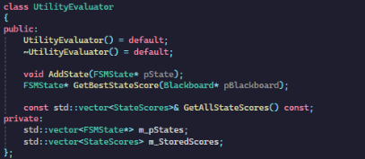
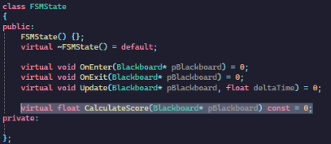
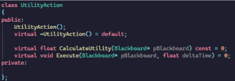
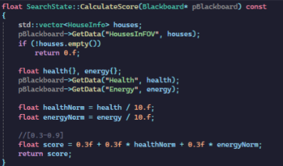
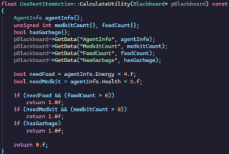
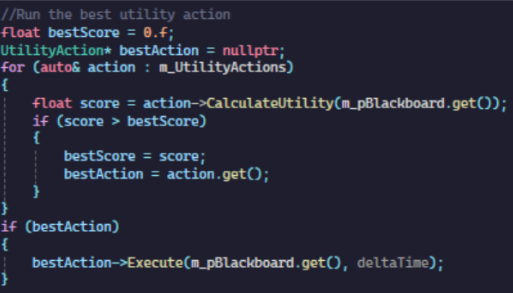
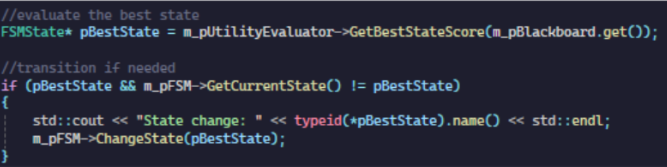

# Utility Ai in Zombie Game
    
## Introduction
This is a research project is made for the gameplay programming course into Utility AI for a zombie game where an agent is coded to act autonomously to survive in an apocalyptic world where it must defend itself from zombies and the environment while searching for limited supplies . Utility AI is well suited for when needing to handle conflicting priorities in a constantly changing environment. The project covers what utility ai is, the benefits and challenges and its implementation into the zombie game.

## What is utility AI?
“utility theory is simply the process of measuring the relative suitability of a particular action ”

Utility Ai is a decision making structure that continuously scores every single possible action and selects the one with the highest score and executes it. Instead of hard coding state transitions or when to use an action, the utility scorer will decided what action to do in regards to the current context. While decisions like choosing between various weapons could be simple as choosing the one with the highest attack power, when taking context into consideration maybe the ranged weapon with slightly lower power would be a better choice if the enemy is far away, or the bomb would better for a wide area attack when there are alot of enemies. In practice the ai would give these weapons a normalised score ranging from 0-1 that constantly change based on the situation. Lastly, a benefit to utility ai is that it isnt concerned with how to execute it, only what actions it should take. This makes it a flexible system as the scoring system can easily be modified by non technical people without having to touch the behaviour code.

## How is my implementation done?
In implementation the Utility AI manages the states and actions the agent can take or do. 

- The Utility Evaluator works alongside the Finite State Machine to decide which state the agent should be in at any given time. For example, if it should it focus on Attacking, Fleeing, Plundering a House, Searching, or Escape a Purge Zone. Utility scores are calculated for each state, and the state with the highest score is activated. This ensures the agent always shifts toward the most appropriate survival strategy based on the current situation.

    
- Additionally Utility action acts independently of the state utilities, it decides which possible action is the best at this moment. The Utility action typically handles the items that are found within the game world. The purpose of the Utility actions serves to be actions that are performed in more than one state.
    

 
## The process of the implementation
A process on how it would work in the game would be that as the agent perceives the world, the agent then gathers data and calculates the utility score based on that data through functions such as CalculateUtility or CalculateScore.

Scores such as these are then gathered and chosen.

Once chosen, the agent will perform that chosen state or action till it decides a better one.

## Conclusion
In conclusion, utility ai can get challenging when alot of factors need to be taken into calculation. When it gets too complex i tend to struggle with computing its score with a proper formula, in the future i'd put more time into into making a better curve for the utility ai's scoring. But if done right it goes to show how powerful utility ai can be.

## Citation
- https://www.gameaipro.com/GameAIPro/GameAIPro_Chapter09_An_Introduction_to_Utility_Theory.pdf
- https://shaggydev.com/2023/04/19/utility-ai
- https://www.gameaipro.com/GameAIPro/GameAIPro_Chapter10_Building_Utility_Decisions_into_Your_Existing_Behavior_Tree.pdf
- https://www.gameaipro.com/GameAIPro3/GameAIPro3_Chapter13_Choosing_Effective_Utility-Based_Considerations.pdf
- https://media.gdcvault.com/gdc10/slides/MarkDill_ImprovingAIUtilityTheory.pdf
- https://gdcvault.com/play/1012410/Improving-AI-Decision-Modeling-Through
- https://psichix.github.io/emergent/decision_makers/utility_ai/introduction.html
- https://en.wikipedia.org/wiki/Utility_system
- https://github.com/linkdd/aitoolkit/tree/main

# Additional Description below:
# Zombie Survival Game

## Description
This part is all about displaying your mastery of the various topics covered throughout the semester. You will program the AI for a player agent in a zombie survival game provided to you by the teachers. 

The agent has limited information about its surroundings. It has a rough knowledge about the world in general and the entities within its line of sight. It’s up to you to put this information to good use. 

The goal of the agent is to survive for as long as possible and get a high score. Your success depends on your ability to collect and use the helpful items scattered throughout the world and the way you handle the threat of the roaming enemy zombies.

Use the tools given to you, the concepts you’ve seen during class and other topics you’ve researched on your own. Besides having a fully working agent you will also explain its architecture on your exam presentation. In this presentation you will explain to us how you’ve built your agent, what the agent is capable of and how well it performs.

## Stages & score
The game consists of multiple stages, each more difficult than the last. Every stage lasts 60 seconds and has its own number and composition of enemies and items. Stronger enemies will become more likely to spawn in later stages and useful items less likely. Starting in stage 3, “Purge Zones” will start to spawn. These will kill everything within range after a delay. They add another layer of complexity to your exploration behavior, but possibly also opportunities to find areas without zombies! 

Additionally, your agent will get a score based on a reward and penalty system. Both the score and the stage you’ve reached serve as an indicator for the quality of your AI and as a metric to compare and compete with your fellow students! There will be a high scores channel on the official Discord server to share your progress.

### Some scoring tips:
Positive score is added for the following actions:

- Each second you survive: 1
- Killing/Hitting zombies : 15 for each kill, 5 for each hit
- Picking up items: 2

Negative score is given for:
- Missing shots: -5 (a shotgun needs to miss all its shots to be counted as a miss) 
 
## Project Requirements
For the implementation of the AI agent you must use the following techniques:
- 	At least one decision making structure (FSM, Behavior Tree, ...)
- 	Movement logic (steering behaviors, combined steering behaviors, ...)

Students are permitted to use the framework implementations of the above techniques. 

Any custom implementations or extra’s will be rewarded. A custom technique could count as a research topic for the other part of the exam.

## Evaluation criteria
-	Agent
    - World exploration
    - Movement *(steering behaviors, combined steering)*
    - Item handling
    - Enemy handling
    - Decision making
